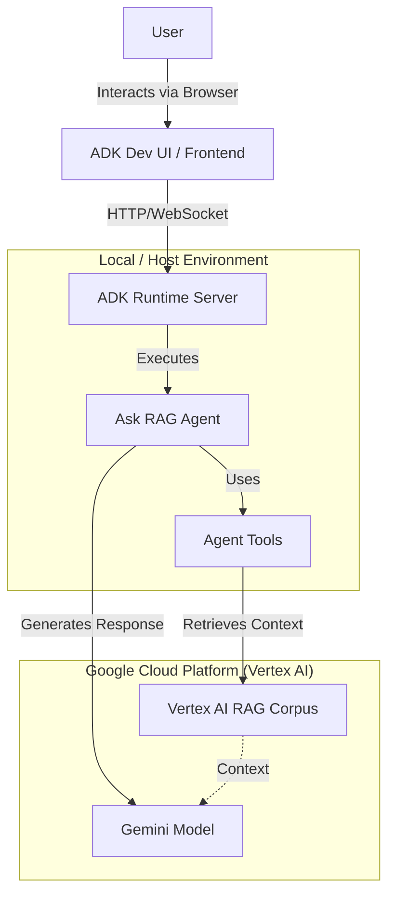
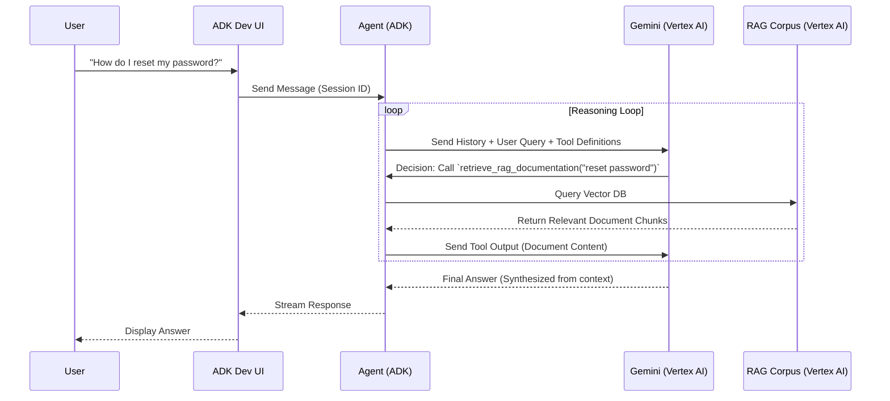

# Architecture Overview: Ask RAG Agent Framework

This document provides a comprehensive architectural overview of the "Ask RAG Agent" framework. It details how the various components—from the user interface to the backend AI services—interact to provide a Retrieval-Augmented Generation (RAG) experience.

## 1. High-Level Architecture

The system is built on the **Google Agent Development Kit (ADK)**, which acts as the orchestration layer connecting the user, the agent logic, and Google Cloud's Vertex AI services.

### System Context Diagram

---

## 2. Component Breakdown

### 2.1 Frontend: ADK Developer UI
The **ADK Dev UI** is the entry point for users. It is a web-based interface served locally when you run `adk web`.
*   **Role**: Captures user input, displays agent responses (streaming text), and visualizes the "thought process" (tool calls, logs).
*   **Communication**: Connects to the backend via REST APIs and Server-Sent Events (SSE) for real-time streaming.

### 2.2 Backend: ADK Runtime
The **ADK Runtime** is a FastAPI-based server that hosts the agent.
*   **Role**: Manages sessions, routes requests to the appropriate agent, and handles the event loop.
*   **Session Management**: Maintains conversation history and state for each user session.
*   **Orchestration**: It receives a user message, passes it to the Agent, executes the Agent's decisions (like calling tools), and streams the results back to the UI.

### 2.3 The Agent: `ask_rag_agent`
The core logic resides in `rag/agent.py`.
*   **Type**: `LlmAgent` (driven by a Large Language Model).
*   **Instruction**: Defined in `rag/prompts.py`. It tells the model *how* to behave (e.g., "Always cite sources", "Don't answer from own knowledge").
*   **Tools**: The agent is equipped with specific Python functions to interact with the outside world.

### 2.4 Vertex AI Integration
The agent relies on Google Cloud's Vertex AI for intelligence and knowledge.
*   **LLM (Gemini)**: The "brain" that understands the query, decides which tool to call, and synthesizes the final answer.
*   **RAG Corpus**: A managed vector database in Vertex AI that stores the documents.
*   **Retriever**: The mechanism that semantically searches the RAG Corpus for relevant chunks of text.

---

## 3. Detailed Request Flow

When a user asks a question, the following sequence occurs:

### Sequence Diagram

---

## 4. Key Components & Mechanics

### 4.1 The Tools (The "Hands" of the Agent)
The agent cannot "see" the RAG corpus directly; it must use tools.
*   **`retrieve_rag_documentation(query)`**: The primary tool. It wraps the `rag.retrieval_query` SDK method. It converts a natural language query into a vector search and returns relevant text chunks.
*   **`list_available_sources()`**: Provides transparency by listing all files currently indexed in the corpus.
*   **`get_file_metadata(file_name)`**: Retrieves specific details (author, date) about a file.

### 4.2 Automatic Function Calling (AFC)
The ADK leverages the LLM's native ability to understand function signatures.
1.  The ADK sends the **Python function signatures** (name, docstring, arguments) to Gemini.
2.  Gemini responds with a structured **Function Call** request (e.g., `{"name": "retrieve...", "args": {"query": "..."}}`) instead of text.
3.  The ADK executes the actual Python function locally and feeds the result back to Gemini.

### 4.3 State & Session Management
*   **Stateless LLM**: The LLM itself is stateless. It doesn't remember the previous turn.
*   **Stateful Agent**: The ADK preserves the **Conversation History** (User messages, Model responses, Tool calls/outputs).
*   **Context Window**: For every new request, the ADK sends the *entire* relevant history to the LLM so it has full context.

### 4.4 Authentication & Security
*   **Google Auth**: The system uses `google.auth.default()` or API keys to authenticate with Vertex AI.
*   **Environment Variables (`.env`)**: Sensitive configuration (Project ID, Location, Corpus ID) is decoupled from the code and loaded at runtime. This ensures code portability and security.

### 4.5 Error Handling & Robustness
*   **Tool Fallbacks**: If the RAG retrieval fails (e.g., network issue), the tool catches the exception and returns an error message string to the LLM. The LLM can then decide to retry or inform the user, rather than crashing the application.
